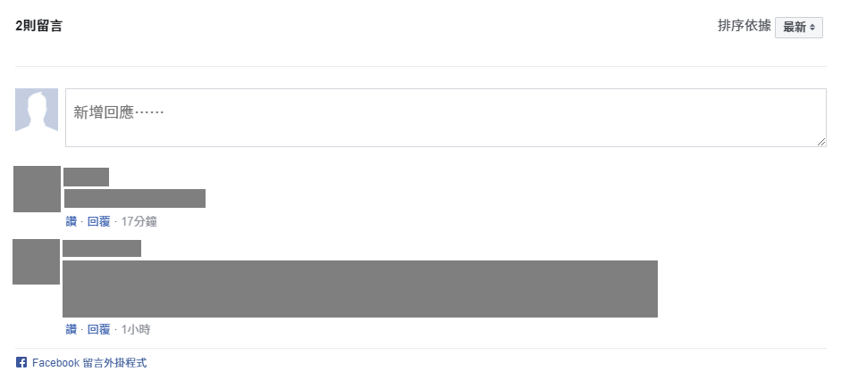
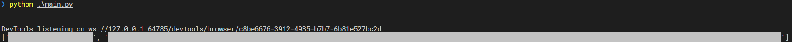

# Comment Crawler

## Dependencies

This project use [poetry](https://python-poetry.org/) to manage dependencies.

To install the dependencies, run

```zsh
poetry install
```

or

```shell
pip install selenium
pip install webdriver-manager
```

## Usage

This project is able to crawl comments from a given URL pattern.

1. Facebook comments plugin only (default)
    

    - 中時新聞網 <https://www.chinatimes.com/>
      - e.g. <https://www.chinatimes.com/realtimenews/20220720004782-260407?chdtv>
    - 華視 <https://news.cts.com.tw/>
      - e.g. <https://news.cts.com.tw/cts/general/202207/202207202086346.html>
    - 東森新聞 <https://news.ebc.net.tw/>
      - e.g. <https://news.ebc.net.tw/news/living/327512>
    - 台灣事實查核中心 <https://tfc-taiwan.org.tw/>
      - e.g. <https://tfc-taiwan.org.tw/articles/7854>
    - 三立新聞網 <https://www.setn.com/>
      - e.g. <https://www.setn.com/News.aspx?NewsID=1148922>
    - 自由時報 <https://news.ltn.com.tw/>
      - e.g. <https://art.ltn.com.tw/article/breakingnews/3998975>
    - 風傳媒 <https://www.storm.mg/>
      - e.g. <https://www.storm.mg/article/4434144>

2. Facebook comments plugin and build-in comments
    

    - ETtoday新聞雲 <https://www.ettoday.net/>
      - e.g. <https://www.ettoday.net/news/20220720/2298682.htm>
    - 聯合新聞網 <https://udn.com/>
      - e.g. <https://udn.com/news/story/7266/6475886>

3. No comments in the given page

    - 中央通訊社 <https://www.cna.com.tw/>
      - e.g. <https://www.cna.com.tw/news/ahel/202207200304.aspx>

### Browser

Modify the browser drivers setup in [`crawler\crawler.py:15`](crawler\crawler.py)

You can use [`webdriver-manager`](https://github.com/SergeyPirogov/webdriver_manager) or manually install the [driver](https://www.selenium.dev/documentation/webdriver/getting_started/install_drivers/) to manage the drivers.

```python
def init_driver(chrome_version: str = '103.0.5060.53') -> WebDriver:
    """Initializes a webdriver.

    Args:
        chrome_version: The version of Chrome driver to use.

    Returns:
        A webdriver.
    """
    driver_manager = ChromeDriverManager(version=chrome_version)
    driver = webdriver.Chrome(service=Service(driver_manager.install()))
    return driver
```

### Crawl

Use `crawl(url: str, size: int = 20) -> List[str]` to crawl comments.

```python
Args:
    url: The url of the page to crawl.
    size: The maximum number of comments to crawl.
Returns:
    A list of comments.
```

example:

```python
# main.py

from crawler import crawl

URL = 'https://www.chinatimes.com/realtimenews/20220720004782-260407?chdtv'
print(crawl(URL, size=10))
```

output:



## Known Issues

1. The driver sometime crashs with the latest version of Chrome (103).
   [reference](https://stackoverflow.com/questions/72719298/selenium-for-chrome-version-103-is-just-crashing-i-know-its-not-my-code-becaus)

   - You can waiting for Chrome 104 or try other browser or driver.
